  <!-- Custom Animated Japanese Sunset/Sakura Banner -->
  

    

  <!-- Dynamic Typing Title -->
  

  <!-- Navigation Bar -->
  

    <a href="#about"><kbd>👋 About</kbd></a> •
    <a href="#skills"><kbd>🛠️ Skills</kbd></a> •
    <a href="#projects"><kbd>🚀 Projects</kbd></a> •
    <a href="#stats"><kbd>📊 Stats</kbd></a> •
    <a href="#connect"><kbd>🌐 Connect</kbd></a>
  

 

---

<!-- About Section -->
<h2 id="about">👋 About Me</h2>

  Hi! I'm <strong>Anupam Raj</strong> — a passionate Full-Stack Developer creating scalable, beautiful, and user-focused web applications.

  <!-- Custom Animated Monospace VSCode Terminal Card -->
  

  Currently exploring: <strong>Rust</strong> • <strong>WebAssembly</strong> • <strong>AI integrations</strong> • Modern Cloud Architecture

 

---

<!-- Skills Section -->
<h2 id="skills">🛠️ Skills & Technologies</h2>

  <h3>🔤 Languages</h3>
  
  
    

  <h3>💻 Frontend</h3>
  

    

  <h3>⚙️ Backend</h3>
  

    

  <h3>🗄️ Databases & Cloud</h3>
  

    

  <h3>🛠️ Tools & Environments</h3>
  

 

---

<!-- Projects Section -->
<h2 id="projects">🚀 Featured Projects</h2>

<table width="100%" border="0" cellpadding="8">
  <tr>
    <!-- Project 1: FarmerHub -->
    <td width="33%" align="center" valign="top">
      
        
      <strong>🌾 FarmerHub</strong>
       
      Farm-to-consumer marketplace connecting agricultural producers directly with buyers.
        
      

        
        
        
      

      <a href="https://github.com/anupamraj176/SAI"><kbd>🔗 Source</kbd></a> • 
      <a href="https://github.com/anupamraj176/SAI#-getting-started"><kbd>🌐 Demo</kbd></a>
    </td>

    <!-- Project 2: Realistic Starfield -->
    <td width="33%" align="center" valign="top">
      
        
      <strong>🌌 Realistic Starfield</strong>
       
      High-performance animated starfield canvas background released as a published NPM library.
        
      

        
        
        
      

      <a href="https://github.com/anupamraj176/my-constellation-bg"><kbd>🔗 Source</kbd></a> • 
      <a href="https://www.npmjs.com/package/my-constellation-bg"><kbd>📦 NPM</kbd></a>
    </td>

    <!-- Project 3: Grid Layout Generator -->
    <td width="33%" align="center" valign="top">
      
        
      <strong>🎨 Grid Layout Generator</strong>
       
      Interactive drag-and-drop CSS Grid builder and code generation utility.
        
      

        
        
        
      

      <a href="https://github.com/anupamraj176/GridLayoutGenrator"><kbd>🔗 Source</kbd></a> • 
      <a href="https://grid-layout-genrator.vercel.app/"><kbd>🌐 Demo</kbd></a>
    </td>
  </tr>
</table>

 

---

<!-- Stats Section -->
<h2 id="stats">📊 GitHub Stats & Insights</h2>

  <!-- Side-by-Side customized GitHub Stats and Streak badges (matching the warm Japanese Sakura theme colors) -->
  <table border="0" cellpadding="4">
    <tr>
      <td align="center" valign="top">
        
      </td>
      <td align="center" valign="top">
        
      </td>
    </tr>
    <tr>
      <td align="center" valign="top" colspan="2">
         
        
      </td>
    </tr>
  </table>

 

---

<!-- Connect Section -->
<h2 id="connect">🌐 Let's Connect</h2>

  
  &nbsp;&nbsp;
  
  &nbsp;&nbsp;
  

 

  <!-- Profile Views & Followers badges -->
  
  &nbsp;
  

  <!-- Quotes Widget -->
  

  <h3>Thanks for visiting! ✨ Let's build something awesome together!</h3>

<!-- Decorative Footer -->

