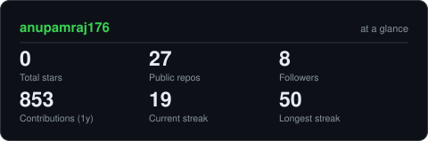
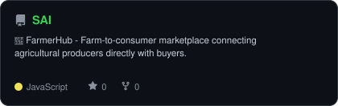
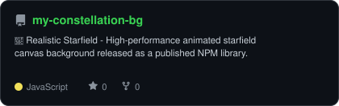
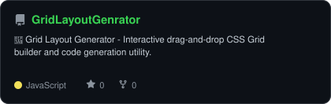

<div align="center">

<!-- PORTRAIT - generated by scripts/dotify.py from img.png -->


<!-- NAME / TAGLINE - animated typing -->
<a href="https://github.com/anupamraj176">

</a>
<br>

<!-- SOCIALS -->
<a href="https://linkedin.com/in/anupam-raj-88833134b/"></a>
<a href="mailto:anupamraj176@gmail.com"></a>
<a href="https://anupam176-portfolio.vercel.app/"></a>
</div>

---

## `~/` whoami

```console
$ cat about.txt
```

Hi, I'm **Anupam Raj**. I'm a passionate Full-Stack Developer creating scalable, beautiful, and user-focused web applications.

- Currently exploring: **Rust** • **WebAssembly** • **AI integrations** • Modern Cloud Architecture
- Portfolio: **[anupam176-portfolio.vercel.app](https://anupam176-portfolio.vercel.app/)**

<br>

<div align="center">

## `~/` toolbox


</div>

---

<div align="center">

## `~/` skill radar

<table>
<tr>
<td width="50%" align="center" valign="middle">
<!-- Self-rated radar - edit assets/skills.json, re-run radar.py -->
<picture>
<source media="(prefers-color-scheme: dark)" srcset="assets/radar-dark.svg">
<source media="(prefers-color-scheme: light)" srcset="assets/radar-light.svg">

</picture>
</td>
<td width="50%" align="center" valign="middle">
<!-- Live radar built from real language byte counts across your repos -->
<picture>
<source media="(prefers-color-scheme: dark)" srcset="assets/radar-langs-dark.svg">
<source media="(prefers-color-scheme: light)" srcset="assets/radar-langs-light.svg">

</picture>
</td>
</tr>
</table>

</div>

---

<div align="center">

## `~/` contribution calendar

<!-- 3D isometric calendar, regenerated by .github/workflows/metrics.yml -->

<br><br>

<!-- Snake eats the contribution graph -->
<picture>
<source media="(prefers-color-scheme: dark)" srcset="https://raw.githubusercontent.com/anupamraj176/anupamraj176/snake-output/github-snake-dark.svg">
<source media="(prefers-color-scheme: light)" srcset="https://raw.githubusercontent.com/anupamraj176/anupamraj176/snake-output/github-snake.svg">

</picture>

</div>

---

<div align="center">

## `~/` the numbers

<!-- Generated by scripts/cards.py — self-hosted, never goes down -->
<picture>
<source media="(prefers-color-scheme: dark)" srcset="assets/card-stats-dark.svg">
<source media="(prefers-color-scheme: light)" srcset="assets/card-stats-light.svg">

</picture>
<br>

<br><br>
</div>

---

<div align="center">

## `~/` selected work

<!-- Cards generated by scripts/cards.py from assets/projects.json -->
<table>
<tr>
<td width="50%">
<a href="https://github.com/anupamraj176/SAI">
<picture>
<source media="(prefers-color-scheme: dark)" srcset="assets/card-SAI-dark.svg">
<source media="(prefers-color-scheme: light)" srcset="assets/card-SAI-light.svg">

</picture>
</a>
</td>
<td width="50%">
<a href="https://github.com/anupamraj176/my-constellation-bg">
<picture>
<source media="(prefers-color-scheme: dark)" srcset="assets/card-my-constellation-bg-dark.svg">
<source media="(prefers-color-scheme: light)" srcset="assets/card-my-constellation-bg-light.svg">

</picture>
</a>
</td>
</tr>
<tr>
<td width="50%" align="center">
<a href="https://github.com/anupamraj176/GridLayoutGenrator">
<picture>
<source media="(prefers-color-scheme: dark)" srcset="assets/card-GridLayoutGenrator-dark.svg">
<source media="(prefers-color-scheme: light)" srcset="assets/card-GridLayoutGenrator-light.svg">

</picture>
</a>
</td>
</tr>
</table>
<sub>

| project | stack |
|---|---|
| **[FarmerHub](https://github.com/anupamraj176/SAI)** | `React` `Node.js` `MongoDB` |
| **[Realistic Starfield](https://github.com/anupamraj176/my-constellation-bg)** | `JavaScript` `Canvas` `NPM` |
| **[Grid Layout Generator](https://github.com/anupamraj176/GridLayoutGenrator)** | `React` `Vite` `GSAP` |

</sub>
</div>

---

<div align="center">

## Random Dev Quote


</div>
